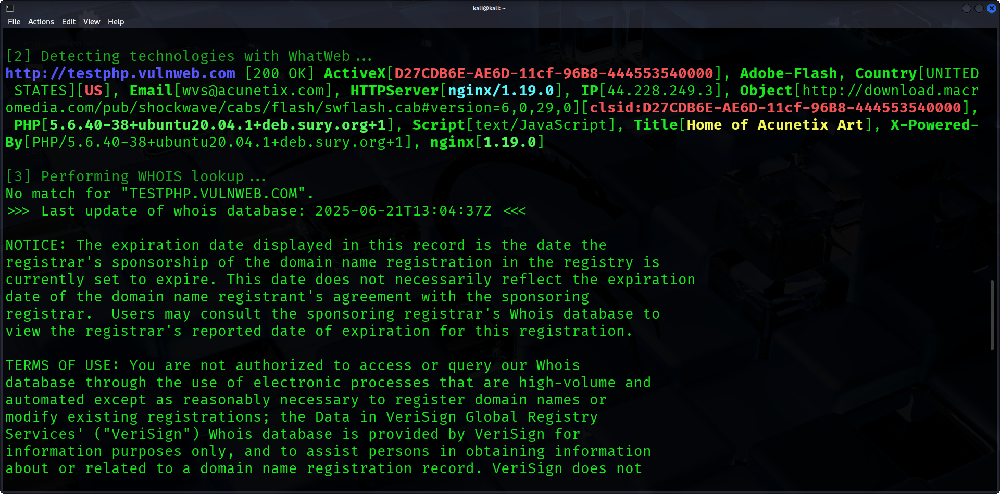

# 🛡️ Automated Vulnerability Scanner (Bash)

This is a Bash script to automate basic vulnerability scanning using built-in Kali Linux tools.

## Tools Used
- Nmap – Port Scanner
- WhatWeb – Technology Detection
- WHOIS – Domain Info
- Nikto – Web Server Vulnerability Scanner

## Features
- Accepts IP or domain from user
- Shows open ports with Nmap
- Identifies technologies with WhatWeb
- WHOIS domain lookup
- Nikto vulnerability scan
- All results displayed in terminal

## How to Run

```bash
chmod +x vulnscan.sh
./vulnscan.sh
```

## Screenshots




